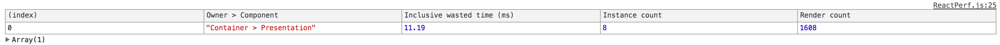

This repo contains a demonstration of good practices to ensure your React Components are efficient.

## tl;dr

1. Only pass required `props` into a component. `<SomeComponent {...this.state} />` is an anti-pattern.
1. Use `PureComponents` whenever possible
1. Using `prop-types` and `forbidExtraProps` from `airbnb-prop-types` will help identify when unecessary `props` are
being passed and will point to areas that can be refactored.

## Setup

Ensure that `jspm` is installed globally:

    npm install jspm -g

Fork and clone this repo, then run:

    jspm install

## Performing the Tests

1. Checkout the commit tagged `ineffecient`
1. Run `npm start`
1. Observe the browser console ouput
1. Checkout the commit tagged `efficient`
1. Run `npm start`
1. Observe the browser console ouput

## Results

Running the `inefficient` version of the app `5x` results in an average of `10.842 ms` wasted time.

Running the `efficient` vserion of the app never produces any wasted time.

## Analysis

The elimination of wasted time is a product of two minor changes.

1. The `Presentation` component is switched from a `functional component` to a `PureComponent`
1. The `Container` component changes from passing the entire `state` object into the `Presentation` component and instead
passes only the `props` that the `Presentation` component requires.

The `PureComponent` is exactly like a `Component` except that it does a shallow `prop` and `state` comparison to determine
if an update is required. In order to take advantage of this feature though, the component must be passed **ONLY** the
`props` it requires so that the shallow `prop` and `state` comparisons don't fail as a result of property changes that
the component does not care about.

In these examples, `props.time` is getting updated every `50ms`. If the entire `state` object is passed down into
the `Presentation` component it will cause unnecessary updates. Even though the `Presentation` component does not
care about the `props.time` updates, it will always fail a shallow comparison check with the previous `props`
because the `Container` component has polluted the `Presentation` components `props` object with the unecessary
`time` property.
